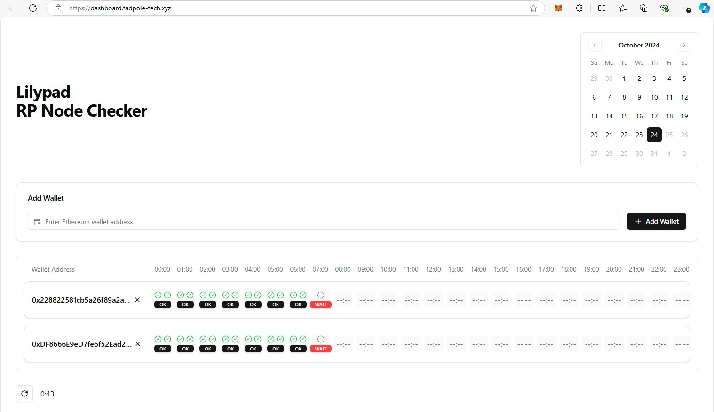

# Lilypad Dashboard

Lilypad Dasboad (lp-dash) aims to help users to view Lilypad node status. At the moment the site allows to monitor the PoW transactions against multiple nodes.

Currently the dashboard is in development and will be updated with new features and improvements.

## Table of Contents

- [Features](#features)
- [Components](#components)
- [Screenshots](#screenshots)
- [Installation](#installation)
- [Usage](#usage)
- [Scripts](#scripts)
- [Project Structure](#project-structure)
- [Contributing](#contributing)
- [License](#license)

## Features

- Multiple nodes / wallets support
- Auto-refresh
- Persistent state using local storage
- PoW transaction details
- Node labeling
- Node metrics (CPU, Memory, GPU, uptime, etc.)
- Node leaderboard details (rank, energy, points)

## Components

This repository contains a modern dashboard application built with React, TypeScript, and Vite. It leverages various UI components and hooks to provide a seamless user experience.

- **React**: A JavaScript library for building user interfaces.
- **TypeScript**: A strongly typed programming language that builds on JavaScript.
- **Vite**: A fast build tool and development server.
- **Tailwind CSS**: A utility-first CSS framework.
- **Radix UI**: A set of accessible, unstyled UI components.
- **Custom Hooks**: Includes custom hooks like `use-toast` for toast notifications.

## Screenshots



## Installation

To get started with lp-dash, clone the repository and install the dependencies:

```sh
git clone https://github.com/yourusername/lp-dash.git
cd lp-dash
npm install
```

## Usage

To start the development server, run:

```sh	
npm run dev
```

This will start the Vite development server and you can view the application at `http://localhost:3000`.

## Scripts

- `dev`: Starts the development server.
- `build`: Builds the project for production.
- `lint`: Runs ESLint to check for linting errors.
- `preview`: Previews the production build.

## Project Structure

```markdown
lp-dash/
├── .gitignore
├── components.json
├── eslint.config.js
├── index.html
├── package.json
├── postcss.config.js
├── README.md
├── src/
│   ├── App.css
│   ├── App.tsx
│   ├── components/
│   │   ├── ui/
│   │   │   ├── accordion.tsx
│   │   │   ├── alert-dialog.tsx
│   │   │   ├── alert.tsx
│   │   │   ├── aspect-ratio.tsx
│   │   │   ├── avatar.tsx
│   │   │   ├── badge.tsx
│   │   │   ├── ...
│   │   ├── WalletStatusGrid.tsx
│   ├── hooks/
│   │   ├── use-toast.ts
│   ├── index.css
│   ├── lib/
│   │   ├── api.ts
│   │   ├── utils.ts
│   ├── main.tsx
│   ├── types.ts
│   ├── vite-env.d.ts
├── tailwind.config.js
├── tsconfig.app.json
├── tsconfig.app.tsbuildinfo
├── tsconfig.json
├── tsconfig.node.json
├── tsconfig.node.tsbuildinfo
├── vite.config.ts
```

## Contributing

Contributions are welcome! Please open an issue or submit a pull request for any changes.

## License

This project is open source and available under the [MIT License](LICENSE).
